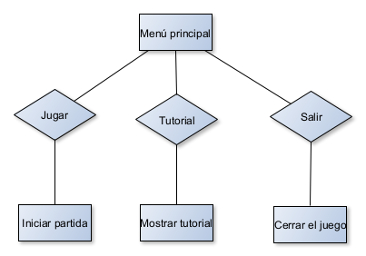
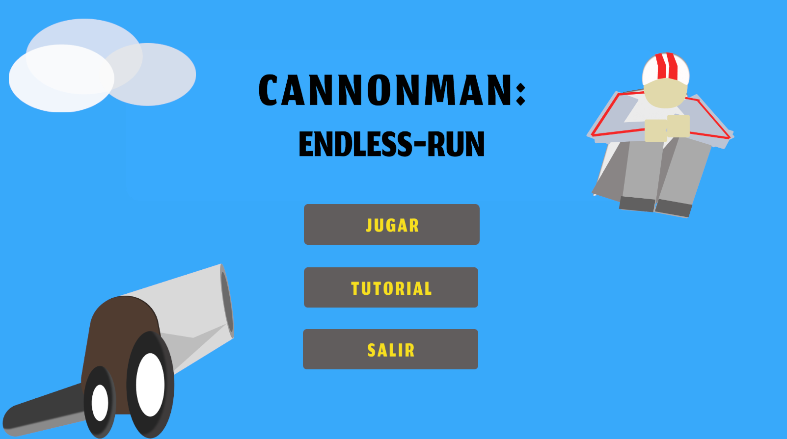
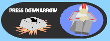

# CANNONMAN: ENDLESS-RUN

## GAME DESIGN DOCUMENT

Creado por: Martín Gago Chorén
Versión del documento: 1.0

## HISTORIAL DE REVISIONES

| Versión |    Fecha   |          Comentarios          |
|---------|------------|-------------------------------|
|   1.0   | 28/04/2024 | Creación y redacción del GDD  |

## RESUMEN

### Concepto

Cannonman: Endless-run es un juego singleplayer en el que manejamos la figura del famoso hombre bala o Cannonman. Nuestro objetivo es mejorar los atributos nuestro personaje para cada vez lograr un nuevo récord y superarnos a nosotros mismos alcanzando nuevas metas. La gracia del juego radica en que se trata de un juego infinito con progresión exponencial, lo que lo convierte en un juego adictivo sin fin. 

### Puntos Clave

Los puntos clave que hacen que Cannonman sea un juego adictivo que incentive al jugador a continuar jugando son:

1. **Sencillez de los controles:** Los controles simples permiten que jugadores de todos los niveles de habilidad puedan disfrutar del juego, desde aquellos experimentados hasta los más casuales que buscan pasar un rato divertido.

2. **Gestión de recursos:** A medida que el juego avanza, mejorar los atributos del jugador se vuelve cada vez más costoso, lo que obliga al jugador a tomar decisiones estratégicas sobre cómo invertir sus recursos para maximizar su progreso de manera eficiente.

3. **Crecimiento exponencial:** El progreso del jugador y la dificultad del juego aumentan de manera exponencial, lo que proporciona una sensación de logro gratificante cuando se alcanzan nuevos récords y metas que parecían inalcanzables anteriormente.

4. **Gameplay infinito:** Cannonman ofrece una experiencia de juego sin fin, donde el único límite es la determinación del jugador por superar sus propias marcas y alcanzar nuevas distancias.

5. **Variedad de obstáculos:** A lo largo del recorrido, los jugadores se encontrarán con una variedad de obstáculos y enemigos que desafiarán su habilidad y destreza. Además, hay elementos que ayudarán al jugador a superar los desafíos y avanzar aún más.

6. **Paisaje y entorno cambiantes:** Conforme el jugador avanza, el paisaje y el entorno se transforman, lo que sirve como indicador visual del progreso del jugador y añade variedad visual a la experiencia de juego.

7. **Juego multitarea:** Un punto clave es que este juego es compatible con realizar otras tareas (escuchar música, ver la televisión, realizar tareas monotonas) puesto que no requiere del 100% de la atención del usuario para poder jugarlo debido a la naturaleza del gameplay

### Género

`Aventura`, `Arcade`, `Gestión de recursos`, `Clicker`, `Endless-runner`, `Incremental-games`.

### Público Objetivo

El juego está dirigido a un público amplio y diverso, con un enfoque principal en jugadores casuales que buscan entretenimiento ligero durante tiempos muertos. El rango de edad al que se dirige abarca desde adolescentes de 16 años hasta adultos de 35 años, lo que refleja su accesibilidad y atractivo intergeneracional. No se hace distinción de género, ya que el juego está diseñado para ser disfrutado por cualquier persona interesada en una experiencia de juego relajada y adictiva.

El tipo de jugador al que se dirige son aquellos que prefieren actividades de ocio simples y poco demandantes, donde puedan disfrutar de la jugabilidad sin la presión de tener que prestar atención constante. Para los adolescentes, el juego puede ser una distracción divertida durante viajes en transporte público o en momentos de aburrimiento, aunque no recomendamos su uso durante clases. Para los adultos, el juego ofrece una forma fácil y rápida de desconectar durante pausas en el trabajo o en momentos de relax en casa.

Otros tipos de juegos que podrían interesar a este público objetivo incluyen otros títulos casuales y adictivos como juegos de puzzles, juegos de ritmo, simuladores simples, y juegos de gestión de recursos. Además, podrían disfrutar de juegos móviles similares que ofrecen una experiencia de juego rápida y gratificante para jugar en cualquier lugar y en cualquier momento.

### Experiencia de Juego

Cuando el jugador se sumerje en Cannonman: Endless-Run, experimentará una experiencia de juego emocionante y adictiva. Visualmente, verá a su personaje (Hombre bala) siendo lanzado desde un cañón, volando a través de paisajes coloridos y variados que cambian a medida que avanza. Los escenarios van desde un bosque hasta desiertos áridos o paisajes nevados, ofreciendo una variedad visual estimulante.

Los obstáculos y enemigos aparecerán en el camino del jugador, desafiándolo a esquivarlos. Desde simples rocas hasta rinocerontes en movimiento o abejas que intentarán entorpecerte. Cada elemento del entorno presenta una amenaza que pondrá a prueba los reflejos del jugador. Pero no todo es negativo; también hay elementos beneficiosos como trampolines que ayudarán al jugador, impulsándolo y proporcionándole una velocidad extra para alcanzar nuevos récords.

Auditivamente, el jugador será envuelto por una banda sonora enérgica y motivadora que añade dinamismo y emoción a la experiencia de juego. Además de esto, el juego ofrece una variedad de efectos sonoros que complementan la acción: desde el estruendo del cañón al dispararse, hasta los sonidos de impacto al chocar con obstáculos, el golpeteo al caer al suelo, y el zumbido de salir disparado por los aires tras un encuentro con un trampolín. Estos elementos auditivos trabajan juntos para sumergir al jugador en una experiencia inmersiva y emocionante.

En términos de jugabilidad, el jugador controla los movimientos de Cannonman con simples controles de teclado, utilizando la barra espaciadora para lanzarlo desde el cañón y la flecha hacia abajo para realizar impulsos verticales. A lo largo del juego, el jugador tendrá la oportunidad de mejorar los atributos de Cannonman, como velocidad, golpeo, deslizamiento y aerodinámica, lo que le permitirá alcanzar distancias aún mayores y superar sus récords anteriores.

En resumen, el jugador experimentará una emocionante carrera infinita llena de desafíos visuales y auditivos, donde cada partida ofrece la oportunidad de superarse a sí mismo y alcanzar nuevas metas.

## DISEÑO

### Metas de Diseño

1. Metas de ambientación:
    - Crear paisajes variados y visualmente atractivos que cambien a medida que el jugador avanza para dar feedback de progreso al jugador.
    - Utilizar efectos de sonido envolventes para aumentar la inmersión del jugador  cada vez que realiza una acción o sudece algún evento dentro del mundo del juego.

2. Metas de jugabilidad:
    - Diseñar obstáculos y enemigos desafiantes que requieran habilidad y reflejos por parte del jugador para superarlos y que obliguen al jugador a esquivarlos para evitar ser penalizado.
    - Diseñar un sistema de enemigos en base al nivel de progresión del jugador de forma que cuando más avanzado esté enemigos más peligrosos pueda encontrarse. (NO DISPONIBLE EN LA DEMO)
    - Generación aleatorio de los elementos interactivos (tanto aliados como enemigos) dentro del terreno de juego para evitar que todas las partidas sean iguales.
    - Implementar elementos de progresión, como mejoras de atributos, para motivar al jugador a continuar jugando y superando sus récords.
    - Proporcionar elementos de ayuda (trampolines) que incentiven al jugador a atreverse a asumir el riesgo de poder ser golpeado por un enemigo a cambio de ser impulsado por un trampolín.
    - Evitar pantallas de carga y otros menús para hacer el gameplay mucho más fluido y agradable para el jugador. (De hecho el menú de gameover tengo previsto eliminarlo, únicamente lo he puesto para cumplir con los requisitos de entrega)

3. Metas de interacción:
    - Desarrollar controles simples que permitan a los jugadores disfrutar del juego sin dificultad independientemente si están familiarizados con los videojuegos o no.
    - Incorporar elementos interactivos como trampolines que proporcionen al jugador ventajas estratégicas y añadan diversidad al gameplay.
    - Botones de mejora para los atributos del jugador que le ayudarán a alcanzar nuevas metas.

4. Metas de rejugabilidad:
    - Implementar sistemas de logros y desafíos que incentiven a los jugadores a regresar y explorar nuevas formas de jugar. (NO DISPONIBLE EN LA DEMO)
    - Ofrecer actualizaciones periódicas con contenido nuevo, como niveles adicionales o eventos especiales, para mantener fresca la experiencia del juego a largo plazo. (EN CURSO)

5. Metas de rendimiento y optimización:
    - Optimizar el rendimiento del juego para garantizar una experiencia fluida y sin interrupciones en una variedad de dispositivos tanto móviles como ordenadores de baja gamma. (EN CURSO)
    - Minimizar los tiempos de carga y optimizar los recursos para garantizar una experiencia de juego rápida eficiente.

## MECÁNICAS DE JUEGO

### Núcleo de Juego

En Cannonman: Endless-Run, las mecánicas del juego se basan en la acción de lanzar al personaje principal, Cannonman, desde un cañón y controlarlo a medida que avanza por un entorno infinito lleno de obstáculos y desafíos. Aquí se describen las principales mecánicas del juego y cómo interactúan entre sí:

#### Lanzamiento desde el cañón
- Regla: Al iniciar cada partida, el jugador lanza a Cannonman desde un cañón con velocidad inicial indeterminada.
- Funcionamiento: Para determinar la velocidad a la que sale despedido el jugador, éste deberá realizar una prueba de habilidad en el que deberá pulsar la tecla **barra espaciadora** en el momento de mayor potencia del cañon. La forma en la que se calcula la velocidad máxima con la que podrá salir despedido el jugador es gracias al atributo de `Velocidad` del jugador y al nivel que éste tenga.

El cálculo de la velocidad máxima proviene de la siguiente función matemática: 
`Base + Mathf.Pow(1.07f, Level) + (0.5f * Level)`
- Función matemática:
    - La velocidad base (`Base`) es un valor constante. Para el atributo de **velocidad** su valor es de: `32f`.
    - La `velocidad máxima cañon` se determina mediante una suma exponencial que depende del nivel del atributo de velocidad de Cannonman (`Level`). Esta suma exponencial se obtiene elevando el valor **1.07** a la potencia del **nivel** del atributo **velocidad**.
    - Además, se agrega un incremento lineal de 0.5 por cada nivel del atributo de velocidad.

El resultado de esta operación matemática proporciona la **Velocidad máxima cañon** a la que Cannonman puede ser lanzado. La velocidad mínima se establece como el `40%` de la **velocidad máxima cañon**, asegurando un rango de velocidad adecuado para el jugador.

#### Impulso vertical/Golpeo
- Regla: Siempre y cuando el jugador esté en el aire, éste podrá activar esta habilidad especial pulsando **Flecha abajo | DownArrow**; Esta habilidad impulsará al jugador verticalmente hacia abajo modificando su trayectoria y permitiendole esquivar enemigos, o alcanzar colchonetas. Esta habilidad sólo puede ser empleada una única vez en el aire y para poder volver a utilizarla es necesario tocar el suelo.
- Funcionamiento: Siempre y cuando se cumpla la regla anterior y el jugador tenga disponible el efecto de **impulso vertical** éste podrá pulsar la **flecha abajo** y se activará este efecto una única vez (La acción del pulsar repetidmente la acción no tendrá otros efectos mientras el impulso vertical esté activo). Cuando el jugado haya impactado con el terreno, o con alguna colchoneta, este efecto se reiniciará, permitiendo al jugador volver a activar la habilidad.  
El cálculo del **impulso vertical** o **golepo** del jugador se determina a través de una fórmula matemática en la que interviene: `Base golpeo`, `Nivel golpeo`, `Velocidad jugador`, y finalmente `Velocidad máxima cañon`.

El cálculo del impulso vertical proviene de la siguiente función matemática:  
`Base + [Mathf.Pow(1.045f, Level) * (Velocidad jugador/Velocidad máxima cañon)] + (Level * 0.2)`
- Función matemática:
    - El valor `Base` es un valor constante. Para el atributo de **golpeo** su valor es de: `11f`.
    - Sobre esta base, se aplica una suma que se calcula a través de realizar dos operaciones:
        - **Potencial**: Elevar el valor **1.045** a la potencia del **nivel** del atributo de **golepo**  `Mathf.Pow(1.045f, Level)` .
        - **Factor**: Dividir la velocidad actual del jugador con la velocidad maxima que el cañon puede expulsar al jugador. `Velocidad jugador/Velocidad máxima cañon`
        - **Caculo**: El valor que se le sumará a la `Base` será la suma entre el Potencial y el Factor calculados anteriormente: `Potencial + Factor`;
    - Finalmente se agrega un incremento lineal de 0.2 por cada nivel del atributo de golpeo.
El resultado de esta operación matemática proporciona el **impulso vertical** del jugador. Para hacer que este valor sea más estable y evitar errores, siempre que se aplica el **impulso vertical o golpeo**, la velocidad en el eje Y (Vertical) inicial se establece el 0, para evitar colapsamientos o anulaciones entre velocidades opuestas. 

#### Deslizamiento
- Regla: Cuando el jugador golpea el suelo éste le aplica al jugador una fricción penalizandolo con una ralentización en su velocidad de movimiento.
- Funcionamiento: Esta mecánica es simple pero crucial en el juego: al golpear el suelo, el jugador sufre las consecuencias.  Se aplica un efecto de fricción al terreno que reduce la velocidad del jugador, incluso llegando a detenerlo por completo. La capacidad de resistir esta fricción se puede mejorar mediante el atributo de `Deslizamiento`. Este atributo reduce la fricción del terreno, lo que permite al jugador mantener una velocidad más constante y evitar detenerse por completo al golpear el suelo. Veamos a continuación como escala el atributo de deslizamiento con la siguiente función:  
`Base - (Level * 0.04f)`
- Función matemática:
    - El valor de `Base` es un valor constante que representa la fricción inicial que tiene el terreno sobre el impacto de un jugador. El valor es la base es de `4f`.
    - Sobre esta base se aplica una resta, que se obtiene a través de un cálculo lineal del **Nivel deslizamiento** multiplicado por **0.04f**. `(Level * 0.04f)`
Este es el único atributo que adquiere un valor máximo o fin. Ya que dentro del motor de desarrollo, el valor de **friction** de un **material** no puede ser negativo. Es por ello que tal y como se han hecho las estadísticas, cuando el jugador alcance el `nivel 100` dentro del atributo de **Deslizamiento** se alcanzará su máximo valor de fricción que sería de 0, es decir, el jugador no sufre penalización al arrastrarse o golpear el suelo. 

#### Aerodinámica
- Regla: Mientras el jugador esté en el aire, o incluso arrastrándose por el suelo, se le aplicará un efecto de resistencia al viento (aerodinámica). Esta resistencia ralentiza la velocidad de movimiento del jugador, y su intensidad varía en función de la velocidad actual del jugador. Cuanto más rápido viaje el jugador, mayor será la ralentización aplicada, y cuanto más lento vaya, menor será el efecto de ralentización.
- Funcionamiento: Para calcular la ralentización aplicada al jugador, se utiliza una función matemática basada en un modelo logarítmico. Esta función logarítmica ajusta la ralentización de manera realista, de modo que a velocidades más altas se aplica una mayor desaceleración, mientras que a velocidades más bajas se aplica una desaceleración menor. Además, el efecto de la aerodinámica puede ser mejorado mediante el aumento del nivel del atributo de aerodinámica. En niveles avanzados, la mejora puede llegar a ser tan significativa que la desaceleración puede convertirse en aceleración, lo que significa que el jugador puede ganar velocidad en lugar de perderla con el tiempo.
A continuación se va a explicar la función que realiza este cálculo y que se aplica sobre el Rigibody2D del jugador:  
`Desaceleracion = Mathf.Log(VelocidadJugador + 1) * (Mathf.Abs(Factor) * 0.003f)`
- Función matemática:
    - `Factor`: es un valor calculado a través de realizar la siguiente fórmula en la que interviene el valor `Base` del atributo aerodinámica y el `nivel` que este tenga. Así el resultado de **Factor** se obtiene de la siguiente manera:  
    `Base - (Level * 0.1f)`. El valor de `Base` es siempre de **8f**, lo que quiere decir que en nivel 80 el factor será 0, y a partir de nivel 81 será negativo.  
    Sobre este factor vamos a aplicar una multiplicación por **0.003f**, esto es para ajustar el resultado final a las magnitudes de nuestro juego.
    - Para evitar errores matemáticos que interfieran con la lógica de nuestro juego, sobre el cálculo de `Factor * 0.003f` vamos a obtener siempre el número absoluto de este cálculo; Es decir, su valor positivo. Para saber si deberemos aplicar una aceleración o deceleración simplemente más adelante gestionaremos el valor original de `Factor` de forma que si es positivo se aplicará una **deceleración** y si es negativo se aplicará una **aceleración**.
    - Sobre la `Velocidad del jugador` se aplicará una función **Logarítmica** que nos permitirá adaptar el efecto deseado en base a la velocidad que tenga el jugador en cada actualización.
    - El `valor logarítimo velocidad jugador` se multiplicará por el valor absoluto de `Factor * 0.0003f`. El valor resultante será la **aceleración** o **deceleración** que aplicaremos sobre la **Velocidad jugaodor**.
- Aplicación de aceleración/deceleración:
    Tal y como se ha mencionado con anterioridad, si el valor de `Factor` es `positivo`, se aplicará una **ralentización**, es decir, el valor de **Desaceleracion** se restará en la velocidad de jugador por cada tick dentro del motor. Por otro lado, si el valor de **Factor** es `negativo`se aplicará una **Aceleración** en el jugador. Esto quiere decir que el valor de **Desaceleración** en lugar de restarse sobre la velocidad de jugador se sumará. Este efecto de aceleración se aplicará a partir de `nivel 81` del atributo de 

#### Ecala de costes de mejora

Todos los atributos o habilidades del jugador presentan el mismo volumen de escala exponencial. El cálculo del nuevo coste de mejora se calcula con la siguiente función matemática:  
`Coste base * Mathf.Pow(1.1f, Level Mejora)`  
Esta función se utiliza para calcular una progresión exponencial en el costo del juego, donde el costo base se multiplica por un factor de crecimiento (1.1) elevado al nivel actual del juego (**Level**). Esto resulta en un aumento gradual del costo a medida que el nivel del juego aumenta.

El valor Base de cada atributo de mejora es el siguiente:
- Velocidad: `25`
- Golpeo: `100` 
- Deslizamiento: `200`
- Aerodinámica: `400`

#### Obtención de puntos

- Regla: El jugador obtiene puntos en base a la distancia que éste ha recorrido en la run.
- Funcionamiento: La obtención de puntos por parte del jugador sigue una función linear, es decir, por cada metro que el jugador avanza, éste consigue 10 puntos. Los puntos que el jugador consiga en cada **Run** o carrera serán almacenados en un contador de **puntos**. Estos puntos son acumulables con otras carreras que el jugados haya hecho con anterioridad y sirven para mejorar los atributos/habilidades del jugador. Los puntos que el jugador vaya gastando a medida que avanza el juego se irán descontando de dicho contador, quedando únicamente los puntos disponibles que tiene para gastar en la **tienda de mejoras**.

#### Enemigos
- Regla: Tocar a los enemigos supone una penalización en la velocidad de movimiento del jugador
- Funcionamiento: Cada vez que el jugador toque el collider2D de cualquier enemigo, se le aplicará una penalización en su velocidad de movimiento. Dicha penalización variará atentiendo al tipo de enemigo con el que colisione. La fórmula a aplicar en las ralentizaciones es siempre un valor `base` + `porcentaje velocidad del jugador`.  
La forma en la que los enemigos aparecen en el terreno de juego es completamente aleatoria. Existe una serie de **spawns** en los que de forma aleatoria puede aparecer un tipo de enemigo de los diferentes posibles. Esto hace que cada **RUN** sea única y difernte a las demás.  
A continuación se detallan cuales son las ralentizaciones aplicadas al jugador según el enemigo con el que colisiona: 
    - Roca pequeña: `10f + 7% velocidad jugador`.
    - Abeja: `15f + 15% velocidad jugador`
    - Roca: `20f + 15% velocidad jugador`
    - Rinoceronte: `30f + 20% velocidad jugador`  

#### Aliados
- Regla: Tocar a los aliados ayudará al jugador proporcionandole un impulso en forma de velocidad calculado mediante una función matemática y en base a otros elementos externos como por ejemplo si el jugador tiene el efecto de `golpeo/impulso vertical` activado.
- Funcionamiento: Cada vez que el jugador golpea una colchoneta, se aplica una función similar a la aplicada con los enemigos: `base` + `porcentaje velocidad del jugador`. Pero existen 2 situaciones posibles cada vez que el jugador golpea la colchoneta:  
    - Rebote normal: El jugador golpea naturalmente la colchoneta sin haber realizado una acción especial. Para estos casos los valores que se aplican en la función son: `Velocidad Base de 15f + 10% velocidad del jugador`
    - Rebote con impulso: El jugador ha golpeado la colchoneta bajo el efecto de **golpeo** o **impulso vertical** en este caso el jugador recibe un **BONUS** en su impulso, siendo estos los valores aplicados en la función: `Velocidad base de 20f + 25% velocidad del jugador`.  
El rebote vertical hacia arriba que recibirá el jugador será porporcional al **impulso vertical**, esto quiere decir que con cuanta más fuerza vertical tenga el jugador en el momento de impactar con la colchoneta, más rebote y altura ganará el juagador.

#### Evolución de mapa
- Regla: Según el jugador vaya recorriendo metros en la run actual, el escenario por el que se mueve irá cambiando. A momento actual el cambio de escenario no supone ninguna ventaja o desventaja para el usuario, simplemente actúa como indicativo visual de cambio de fase.
- Funcionamiento: En base a la distancia recorrida por el usuario existen diferentes fases o escenarios que se activan de manera automática. Los escenarios existentes a momento actual son los siguientes:
    - Bosque: Escenario base. Este escenario va desde los `0m` recorridos hasta los `5.000m`.
    - Desierto: Es el tercer escenario del videojuego. El escenario abarca desde los `5.001m` hasta los `25.000`.
    - Campo nevado: Es el segundo escenario del nivel. Este Escenario va desde los `25.001m` hasta los `100.000`.
    - Cementerio: Es el escenario final del vieojuego. Este escenario se encuentra tras superar los `100.000m`. No existe un escenario superior, siendo éste el escenario final del videojuego. 

### Flujo de Juego
A continuación el grafo del menú principal del juego:  

Por otro lado este sería el flow graph de la interfaz del juego:  

### Fin de Juego

#### Derrota
1. Velocidad del jugador alcanza 0 km/h: La partida llega a su fin cuando la velocidad del jugador se reduce a 0 km/h. Esto puede ocurrir debido a varias situaciones, como golpear un obstáculo, chocar contra el suelo o detenerse por completo debido a la desaceleración. En cualquier caso, una vez que la velocidad del jugador llega a 0, se considera una derrota.
#### Salir del juego
2. Decisión del jugador de salir del juego: Otra forma de finalizar la partida es cuando el jugador decide salir del juego o reiniciar la partida. Esta acción se considera una derrota, aunque no haya sido causada por una situación dentro del juego en sí, sino por la decisión del jugador de poner fin a la sesión de juego.

### Física de Juego

La física en el juego se centra únicamente en el personaje principal, que es lanzado desde el cañón y controlado por el jugador. Los elementos adicionales como enemigos, cañones o aliados modifican la física del personaje principal, pero no tienen física propia.

**Jugador Principal**: Su física se gestiona mediante las herramientas proporcionadas por Unity a los desarrolladores. El objeto que representa al jugador contiene un componente `Rigidbody2D`, que define su masa y la gravedad a la que está sujeto.  
Además, el jugador cuenta con un `BoxCollider2D` para manejar las interacciones físicas con elementos como el terreno. Este collider tiene un material asociado que establece las siguientes propiedades:
    1. **Friction**: Controla el deslizamiento del jugador contra otros elementos colisionables, como el terreno. Inicialmente establecido en **4**, este atributo puede modificarse a medida que avanza el juego mediante la habilidad de `Deslizamiento` del jugador, alcanzando un máximo de **0**.  
    2. **Bounciness**: Define la capacidad de rebote del jugador contra otros elementos colisionables. Su valor es constante en 0.2. 

Por otro lado, en el entorno del juego se implementa una física de ralentización, o `aerodinámica`, que afecta la velocidad del jugador en el eje X. Este cálculo se realiza dentro del propio jugador en **función de su velocidad**. [Ver detalles](#aerodinámica)  
Finalmente, el `impulso vertical` es otra característica física del juego. Consiste en una **anulación de la velocidad en el eje Y** del jugador, combinada con una **fuerza de impulso vertical** aplicada sobre su cuerpo. [Ver detalles](#impulso-verticalgolpeo)  

**Suelo**: Funciona como un elemento colisionable estándar para el jugador, sin tener físicas especiales. 

**Enemigos y aliados**: Aunque no poseen físicas propias, interactúan con la física del jugador. Tanto los aliados como los enemigos están equipados con un `BoxCollider2D` que actúa como un detector de colisiones, constantemente atento a la presencia del jugador. Cada interacción del jugador con estos elementos altera su física. Los enemigos reducen la velocidad horizontal del jugador según unos valores predefinidos, mientras que las colchonetas aumentan tanto la velocidad horizontal como la vertical ascendente del jugador al colisionar con ellas.

### Controles

En el siguiente apartado se van a explicar a detalle los controles necesarios para poder jugar a Cannonman:

#### Menú principal y otros menús

Tanto en el menú principal como en otros menús, como por ejemplo el de **escape** o **game over**, los controles existentes en la versión 1.0 son exclusivamente de ratón. El uso del ratón permite al usuario navegar y hacer clic en los diferentes botones de acción, como `Jugar`, `Tutorial` y `Salir` en el menú principal, y `Continuar`, `Reiniciar` o `Salir` en el menú de escape. Hasta la fecha actual, no existen ayudas para personas con discapacidades. Este es un aspecto importante a considerar para una futura versión oficial del videojuego.

#### Controles del gameplay.

**Abrir el menú de escape/pausa:**  
Para abrir el menú de escape o pausa, hay dos opciones disponibles. Una de ellas es hacer clic con el ratón en el botón correspondiente ubicado en la interfaz, en la parte superior derecha de la pantalla del juego. Para cerrar el menú de pausa, se puede seleccionar cualquiera de las opciones disponibles dentro del propio menú.

La otra alternativa es pulsar la tecla `"ESC"` para abrir el menú de pausa, y pulsar nuevamente `"ESC"` para cerrar el menú.

**Lanzar el personaje:**  
Para lanzar el personaje desde el cañón, el jugador debe pulsar la tecla `barra espaciadora` en el momento de mayor potencia. En la interfaz del videojuego aparecerá una barra de carga con valores cambiantes que se fijará en el momento en el que el jugador presione la tecla indicada. Además, hay una animación de ayuda a la derecha indicando la acción que debe realizar.

**Impulso vertical:**  
Esta habilidad se activa con la tecla `flecha hacia abajo` o `DownArrow`. Una interfaz visual no interactiva a modo de ayuda indica si se puede o no pulsar la habilidad de **golpeo**. Se encuentra en la parte superior derecha de la pantalla de juego.

**Comprar en la tienda de mejoras:**  
La tienda de mejoras está permanentemente disponible en la parte superior izquierda de la interfaz de juego. Consta de 4 botones que se pueden clicar. Para interactuar con ellos, se necesita el uso del `ratón`. Si el jugador no tiene suficientes puntos, los botones estarán inhabilitados y no realizarán ninguna acción al hacer clic sobre ellos.

Hasta la versión 1.0, la única forma de interactuar con la tienda de mejoras es a través del ratón, sin existir ninguna alternativa para personas con discapacidades.

## MUNDO DEL JUEGO

### Descripción General

El mundo en el que se encuentra el jugador estaría ambientado en el planeta Tierra, con algunos aspectos fantásticos. El estilo del terreno es cartoon 2D con mucho colorido y que llama la atención. Todos los terrenos tienen la misma característica común y es que se conforman por 5 capas, ordenadas de mayor a menor profundidad:
1. Cielo o fondo
2. Nubes en el cielo
3. Montañas lejanas
4. Montañas cercanas
5. Otros elementos visuales cercanos  no interactuables (árboles, cáctus, etc).  

Estas capas tienen un efecto `parallax` para dar mayor dinamismo y movimiento al terreno de juego.  
Atendiendo a la distancia recorrida por el jugador, el *bioma* en el que se encuentra irá cambiando. Estos son los `Biomas` actuales existentes en el juego ordenados por orden de aparición:

#### Bosque:

#### Desierto árido
  

#### Campo nevado

#### Cementerio oscuro 

### Personajes

Dentro del universo de CANNONMAN: Endles-Run existen 3 tipos de personajes: `Personaje principal` `Personajes interactuables` y `Enemigos`. A continuación se muestra una ficha técnica de cada uno de ellos y de sus habilidades.

#### Jugables
**CANNONMAN**: Es el personaje principal que maneja el jugador y sobre el que gira el desarrollo del juego.  

**Apariencia**: Su apariencia es bastante peculiar y digna de llamar la atención. Cannonman viste con un duro casco blanco con 2 líneas rojas que parece protegerle de todos los impactos que éste debe sufrir tras cada lanzamiento que realiza. En cuando a su cuerpo, viste un ceñido mono blanco con 1 linea roja que atraviesa las mangas de sus brazos. Los zapatos son de un gris claro que combina con su impoluto traje blanco.

**Comportamiento**: Cannonman una vez ha sido despedido de su cañon presenta 2 comportamientos o estados.
- Estado normal: Es su estado natural en forma de bola que le permite protegerse sus órganos vitales en caso de impacto contra una superficie o enemigo.
- Estado de impacto vertical: Es su estado alternativo tras realizar su habilidad de `Golpeo`, en este estado Cannonman se impulsa verticalmente contra el suelo o contra lo que encuentre por su camino.  

**Habilidades**: como tal **Cannonman** presenta una única **habilidad activable** que es el efecto de `golpeo` o **impulso vertical**. Aunque si presenta otros atributos como son `Velocidad`, `Deslizamiento` o `Aerodinámica` que interactúa en cómo el personaje es afectado por las físicas y entorno del mundo.

|      CANNONMAN en su estado normal         | CANNONMAN en su estado de impulso vertical |
|--------------------------------------------|--------------------------------------------|
|  |  |

#### Interactuables

**Cañon**: Es el personaje con el que interactúa el personaje principal. (LLamarse Cannonman y no ir acompañado de un cañon sería algo peculiar)

**Apariencia**: Robusto, grande, potente, ruidoso y poco seguro; Esas son los adjetivos con los que definiría el cañoon. Me pregunto si eso cumplirá con todos los controles de seguridad...

**Comportamiento**: El personaje principal se encuentra dentro del cañon. Es necesaria la habilidad del jugador para hacer que Cannonman salga despedido en el momento de mayor potencia. El cañon presenta una barra de carga que varia sus valores desde un mínimo a un máximo a una gran velocidad. El jugador deberá pulsar la tecla de acción (**Barra espaciadora**) para hacer que el cañon dispare a nuestro heroico personaje principal por las tierras de nuestro mundo. La potencia maxima y mínima con la que el cañon disparará al personaje viene dado por el atributo de `Velocidad` con el que cuenta Cannonman.

**Habilidades**: su principal habilidad es la de lanzar a nuestro afable jugador por los aires. Vaya, no me gustaría estar en su lugar.

**Cama elástica**: Es el otro elemento con el que puede interactuar el jugador. Las camas elásticas serán tu mayor aliado para aumentar tu velocidad y altura. Siempre que veas una intenta golpearla bajo el efecto de `Golpeo`, !Lograrás un mayor impulso!

**Apariencia**: Un trasto viejo que parece sacado de un circo. Tiene forma circular, se sostiene sobre unas endebles patas de aluminio y tiene unos muelles que cuando saltas sobre ellos emiten un molesto ruido. No tiene pinta de que sea muy seguro, eso parece hacerlo incluso más divertido!

**Comportamiento**: Cada vez que el personaje principal actúa con las camas elásticas éstas le daran un buff de velocidad y de altura. Dentro de este comportamiento principal existen 2 posibilidades de actuación:
1. Rebote normal: Es el rebote que recibe el jugador tras golpear la cama elástica bajo un efecto normal.  
2. Rebote con impulso: Es un rebote con mayor intensidad. Para lograr este efecto el jugador debe golpear la colchoneta bajo el efecto de `golpeo`.  

Pulsa [Ver más detalles](#aliados) para ver cómo se calculan estos valores con mayor detalle.

**Habilidades**: Impulsar al jugador aliado de forma vertical y dándole un aumento de velocidad horizontal.

#### Enemigos

**Roca pequeña**: Es un elemento fijo del mapa, golpearte contra ella te provocará una penalización en tu velocidad de movimiento.

**Apariencia**: Diminuta, de color gris, y tan dura como una... ¿Roca? La roca tiene unos ojos apagados y cara de aburrida; Es normal, no debe ser muy divertido estar todo el día en el mismo sitio.

**Comportamiento**: La roca pequeña no tiene ningún tipo de comportamiento especial. Se mantiene estática en su área de aparición. A la espera de que algún pobre desalmado la golpee.

**Habilidades**: La habilidad principal que tiene la roca es la de entorpecer el paso al jugador. Si al jugador se le ocurre colisionar con una roca éste recibirá una penalización en su movimiento. Puedes ver con más detalle el cálculo de la penalización haciendo [Click aquí](#enemigos)

**Roca**: Es un elemento fijo en el mapa, golpearte contra ella provocará en el jugador una penalización en la velocidad de movimiento. Es peor que una roca pequeña, esta roca causa mayor efecto en la ralentización del usuario, aparte de ser de mayor tamaño, con lo que la vuelve más dificil de esquivar.

**Apariencia**: Mantiene la misma apariencia que una roca pequeña, gris, cara de aburrida e incluso más dura que una roca normal. A diferencia de una roca pequeña esta tiene un tamaño considerablemente mayor.

**Comportamiento**: Al igual que la roca pequeña, esta roca no tiene ningún comportamiento especial. Se mantiene inmovil en el terreno a la espera de que un jugador despistado choque contra ella. 

**Habilidades**: La habilidad de este tipo de roca es entorpecer el paso del jugador. La penalización a aplicar sobre el jugador será considerablemente mayor a la que ocasiona la roca pequeña. Puedes ver en más detalle la penalizacón haciendo [Click aquí](#enemigos).

**Rinoceronte**: Furioso, rápido e inamovible, el rinoceronte supone la mayor amenaza para el jugador en lo que al suelo se refiere. Los rinocerontes son animales muy territoriales, y este no es menos. El rinoceronte estará patruyando su territorio de izquierda a derecha, lo mejor es que nadie se cruce en su camino.

**Apariencia**: Fuerte, grande, rápido y... ¿Rojo? Por si acaso quedaban dudas si éste podría ser un aliado nuestro su color rojo no nos indica lo mismo. 

**Comportamiento**: Este ser terreste presenta un comportamiento que puede llegar incluso a ser impredecible. El rinoceronte realizará un "patrullaje" de izquierda a derecha sobre su área de aparición. Esto hace que sea dificil de esquivar por un jugador que viene realizando un **golepo** contra el suelo.

**Habilidades**: Este tembible animal al golpear al jugador le ocasionará una ralentización crítica en su velocidad de movimiento. El rinoceronte es el animal terreste con mayor penalización de velocidad de movimiento para Cannonman. Puedes consultar sus estadísticas de ralentización haciendo [click aquí](#enemigos).

**Abeja**: bzzzzzzzzzzzzzz bzzzzzzzzzzzzzzzzz, la abeja vuela de arriba a abajo en lo que parece ser un baile típico de esta especie. Espero no ser alérgio a este tipo de animal...

**Apariencia**: Con sus colores amarillo y negro y sus diminutas alas que realizan un esfuerzo titanico por mantenerla en el aire, la abeja es el único animal volador al que se debe de enfrertar Cannonman. La abeja cuenta con unos ojos rojos que nos hacen indicar que es mejor no acercarse a ella.

**Comportamiento**: El comportamiento que presentan las abejas es un movimiento vertical de arriba a abajo, esto hace que resulte dificil de esquivar en el aire.

**Habilidades**: La habilidad que presenta la abeja es similar a la de los enemigos anteriores, molestar e impedir el paso del personaje principal. El hecho de tocar a la abeja ocasionará en el jugador una penalización en el movimiento. Puedes consultar las estadísticas específicas de este animal ostil haciendo [click aquí](#enemigos).

### Objetos

Actualmente en Cannonman, no existen objetos dentro del juego. Lo más próximo a estos objetos son las habilidades del personaje que mejoran nuestras estadísticas y capacidades. Las diferentes habilidades se indicarán a continuación, y se encuentran disponibles dentro de la tienda de mejoras.

#### Velocidad

Es la capacidad maxima que tiene el cañon de impulsar al jugador. La velocidad mínima es el 40% de la velocidad máxima. Se encuentra disponible en la tienda de mejoras.  

#### Golpeo

Es la habilidad que permite al jugador realizar un impulso vertical contra el suelo. El cálculo de esta habilidad depende en parte de la **velocidad** del jugador. Esta habilidad se encuentra disponible en la tienda de mejoras.  

#### Deslizamiento

Esta habilidad controla la capacidad del jugador de deslizarse por el terreno de juego sin perder velocidad. Esta habilidad tiene como máximo el **nivel 100**. Se encuentra disponible en la tienda de mejoras.  

#### Aerodinámica

Esta es la habilidad más cara de todas. Es la encargada de aplicar un efecto de ralentización sobre el jugador en base a su velocidad actual. En el **nivel 80** la aerodinámica es neutra, es decir, no afectará negativamente a la velocidad del jugador. A partir del **nivel 81** se volverá positiva, haciendo que el jugador acelere con el paso del tiempo. `A Adrian Newey le interesa esto.`  

### Flujo de Pantallas

Las pantallas existentes en el videojuego Cannoman son únicamente el `menú principal` y la `pantalla de juego`.

#### Menú principal
Es la primera impresión que recibe el jugador al iniciar el videojuego. Presenta un fondo azul, el título del juego, las imágenes de los elementos más representativos del juego (El cañon y el personaje principal o Cannoman). Los elementos interactuables de este menú principal son 3 botones de acción que permiten al usuario:
1. Iniciar partida
2. Acceder a un pequeño tutorial informativo
3. Salir del juego

Al pulsar sobre el tutorial se muestra un pequeño panel con un texto explicativo con las características generales del juego.  
Por otro lado, al pulsar en "Jugar" se abrirá la escena del gameplay, es decir, la **pantalla de juego**.

#### Pantalla de juego
Es la escena en la que se desarrolla la acción del videojuego. En ella se sitúan los enemigos, elementos interactuables y el personaje principal. Tamibén se encuentra el entorno o biomas, los cuales van cambiando a medida que el jugador avanza. Ojo, aunque la escena vaya cambiando es SIEMPRE la MISMA PANTALLA.  
La forma en la que la pantalla de juego se ha creado, es similar a un teatro; El escenario es siempre el mismo, lo único que cambia son los adornos de fondo. Aquí ocurre algo similar, todos los biomas se crean bajo esta misma pantalla, pero se aplican cambios en los "adornos" cada vez que ocurre algún evento. En este caso el evento es alcanzar cierta distancia recorrida.  
En esta pantalla de juego están visibales a mayores que los elementos citados con anterioridad la interfaz de usuario. En la interfaz es visible:
- Barra de pontencia del cañon y su respectivo incicador de ayuda que muestra al usuario que botón pulsar.
- Menu de tienda de mejoras y puntos disponibles para gastar.
- Barra de progreso y de puntuación conseguida.
- Datos en tiempo real (Velocidad del jugador, altura, distancia recorrida).
- Indicador de estado del jugador (Si está bajo el efecto de impulso vertical o no) que le indica si tiene su habilidad disponible.
- Botón de acceso al menú de pausa o ajustes.

### HUD

Los elementos del HUD son vitales en nuestro videojuego para darle información en tiempo real de la situación actual del jugador. Tanto para informar de su progreso en partida, como para ver sus puntos disponibles para gastar en la tienda.  
El **HUD** del videojuego se compone principalmente por:

**Estadisticas en tiempo real**  
Se situan debajo de la tienda de mejoras en el lateral izquierdo del videojuego. El propósito de este elemento es mostrar al jugador información en tiempo real de la situación del jugador. En este elemento se muestran los siguientes datos:  
1. Distancia total recorrida en la run
2. Altura del personaje
3. Velocidad del personaje.
Estos datos son vitales para el jugador y le proporcionan la información sufiente que le ayudarán en la toma de decisiones.  
  

**Barra de potencia**  
Se Situa en la parte inferior izquierda de la pantalla. Este elemento se encarga de mostrar al jugador una barra de potencia indicativa de la fuerza con la que saldrá despedido el jugador. A mayores, esta interfaz cuenta con un elemento de ayuda que indica al jugador en todo momento la tecla asignada que debe pulsar para poder realizar la acción. Esta ayuda especial desaparecerá una vez la acción haya sido completada.  
  

**Barra de progreso**  
Ubicada en el centro de la parte superior la barra de progreso es el claro indicativo que indica al jugador que está avanzando en el mapa y cómo de cerca está del próximo destino. En la barra de progreso se indica con un punto la ubicación del jugador con respecto a un "total". También en la barra de progeso se indican los **puntos totales** es decir, la cantidad de puntaje total obtenida por el jugador en la run actual. La barra de progreso es vital para evitar la frustración y darle feedback al usuario de su avance en la partida.  

**Estado del jugador**  
Se encuentra a la derecha de la barra de progreso. Este HUD únicamente se activa en la run. Muestra información al jugador del estado del personaje, indicandole si tiene disponible el impulso vertical o no. Este indicador muestra el sprite del jugador en su estado actual. Cuando la habilidad está disponible se activa una ayuda que le indicará al usuario que puede pulsar **flecha hacia abajo** o **DownArrow** para activarla.  

|      Estado jugador normal        | Estado jugador efecto impulso vertical |
|--------------------------------------------|--------------------------------------------|
|  |  |

**Puntos disponibles**  
Situado debajo de los botones de la tienda mejoras; Esta interfaz se actualiza en tiempo real e indica al jugador el saldo de puntos que tiene disponible para gastar en la tienda.  

**Nivel y coste de las habilidades**  
Se encuentra  integrado en los propios botones de la tienda de mejoras. Estos elementos ayudan a indicarle al jugador en qué nivel se encuentra cada una de sus habilidades. También se indica el coste que supone mejorar dicha habilidad.  

A modo de visión global, estos los TODOS los elementos del HUD disponibles en el juego:  

## ARTE

### Metas de Arte

El arte del juego se enfoca en lograr un estilo único y colorido que se asocie instantáneamente con la identidad del juego. Se ha optado por un estilo de arte cartoon en 2D, el cual se caracteriza por su simplicidad y colores vibrantes. Este estilo no requiere de detalles excesivos, lo que lo hace ideal para un juego en constante movimiento como este.

En cuanto a los escenarios, se busca crear entornos dinámicos y llamativos que mantengan la atención del jugador sin distraerlo demasiado del gameplay. Los escenarios tienen un diseño caricaturesco y alegre, con elementos reconocibles pero estilizados para adaptarse al universo del juego. Se prioriza la claridad visual y la facilidad de reconocer obstáculos y elementos interactivos.

Por otro lado, en cuanto a los personajes, se busca transmitir personalidad y expresividad a través de diseños simples pero efectivos. Los personajes tienen un aspecto caricaturesco y divertido, con rasgos distintivos que los hacen fácilmente reconocibles. Se busca que la apariencia de los personajes refleje su comportamiento y habilidades en el juego, manteniendo la coherencia con el estilo visual general.

### Assets de Arte

A momento actual no se disponen de las animaciones en todos los elementos del videojuego. Pese a ello, en el siguiente apartado se mostrarán los assets y animaciones incluidas en el juego:

#### Jugador
Estados:
|      Reposo       | Impulso vertical |
|-------------------|------------------|
|  |  |
Fluidez entre estados:  
- No hay animación entre los dos estados debido a limitaciones de tiempo y recursos.
- A pesar de esto, la transición entre estados se logra de manera fluida gracias a la naturaleza del juego.

#### Enemigos

**Roca pequeña y Roca normal**:  
Las rocas presentan un constante esado de reposo ya que se mantienen inmóviles en el terreno de juego. Los assets de la **roca pequeña** y de la **roca normal** son los mismos, salvo que cambia la escala de los mismos. Esto se ha realizado para ahorrar tiempo de desarrollo.  

|      Reposo       |    Animación   |
|-------------------|----------------|
|  |  |

**Rinoceronte**:  
El rinoceronte presenta un estado constante de patrullaje en el que se mueve de lado a lado vigilando un área determinada. Para hacer este movimiento más fluido se le han establecido animaciones de movimiento, las cuales se encuentran en la siguiente tabla:  

|      Reposo       |    Animación   |
|-------------------|----------------|
|  |  |

**Abeja**:  
La abeja presenta tambien un estado constante de patrullaje, pero en este caso con un movimiento vertical de arriba a abajo. Esta acción de patrullaje tiene una animación por defecto que se muestra en la siguiente tabla:  

|      Reposo       |    Animación   |
|-------------------|----------------|
|  |  |

#### Elementos interactivos

**Cañon**:  
El cañon debido a la falta de tiempo y de recuros únicamente presenta un asset por defecto, que es el de su estado normal. Como previsión a futuro se espera añadir una animación de lanzamiento para ofrecer una experiencia de calidad al usuario.

**Trampolin**:  
El trampolin es otro asset que debido a la falta de tiempo únicamente presenta un estado de reposo y no contiene animación de salto. Se prevee añadir animación de rebote cada vez que el jugador interactúe con él:

## AUDIO

### Metas de Audio

El enfoque musical y sonoro del juego se centra en crear un ambiente tranquilo y relajado que se ajuste a la situación del juego, donde el personaje principal sobrevuela paisajes fantásticos durante períodos prolongados. El objetivo general del audio es proporcionar una experiencia auditiva que complemente la jugabilidad y la atmósfera del juego.  

#### Música:  
Se busca una música tranquila, sosegada y sencilla.
Debe ser lo suficientemente suave y poco intrusiva para poder escucharse durante largos períodos de tiempo sin llegar a ser molesta.  
Se ha tomado como referencia la música de Minecraft, ya que refleja el ambiente tranquilo y relajado que se desea para el juego.  
#### Efectos de sonido:
Los efectos de sonido se utilizarán para realzar la experiencia del juego y mejorar la inmersión del jugador.
Los efectos de sonido al interactuar con elementos del juego, como el sonido del cañón al dispararse, los golpes contra obstáculos o el impulso vertical del jugador, ayudarán a proporcionar retroalimentación al jugador y mejorar la sensación de control.
#### Silencio:
No se contempla el uso del silencio en el gameplay del videojuego, ya que no se pretenden realzar momentos de tensión o de superación entre niveles ya que ese no es el punto de la música.  

En el diseño sonoro del juego, se opta por una perspectiva que brinde al jugador la libertad de elegir su propia banda sonora. La música de fondo se caracteriza por ser tranquila y relajada, acorde con la atmósfera de los paisajes que el jugador sobrevuela durante su aventura. Además, los efectos de sonido se mantienen sutiles y no intrusivos, permitiendo que el jugador los silencie si así lo prefiere. En lugar de utilizar el silencio para crear momentos de tensión o dramatismo, se da prioridad a la experiencia personalizada del jugador, quien puede disfrutar del juego con su propia selección musical sin que los efectos de sonido interfieran en su experiencia de juego.

### Assets de Audio

#### Música  
1. Música del menú principal
2. Música de la escena principal del juego

#### Sonidos  
En este aspecto si existe mayor variedad de sonidos para hacer frente a las posibles situaciones que pueda vivir el jugador. Se disponen de assets de sonidos para las siguientes situaciones:  
- **Clicks en botones y otros elementos interactuables**: Se reproduce un sonido cada vez que el jugador interactúa con un botón o elemento interactuable en el juego.
- **Sonido de lanzamiento del cañón**: Se emite un estruendoso sonido cada vez que el jugador es lanzado desde el cañón. El objetivo es proporcionar inmersión al jugador en las acciones que realiza.
- **Golpeo contra enemigos**: Al golpear a un enemigo, se reproduce un sonido característico de dolor. Este sonido ayuda al jugador a entender lo que está sucediendo en medio del caos de las altas velocidades.
- **Golpeo contra el suelo**: Cuando el jugador activa el impulso vertical y choca contra el suelo, se reproduce este sonido para indicar al jugador lo sucedido.
- **Rebote con la colchoneta**: Este efecto de sonido brinda al jugador retroalimentación sobre lo que está ocurriendo en la pantalla.

## DETALLES TÉCNICOS

### Plataformas Objetivo

La principal plataforma en las cuales se valora inicialmente la publicación del videojuego sería:
 **Ordenador**: Dentro de los ordenadores de sobremesa o portátiles existen 2 plataformas objetivo en las que publicar el videojuego:
 1. **Navegador web**: Una de las ideas a valorar sería la de permitir el acceso al juego a través de navegador web. Con esto se consigue atraer a un público casual que quiera pasar tiempos muertos desde cualquier dispositivo o ordenador.
 El juego debe ser compatible con los principales navegadores web como Google Chrome, Mozilla Firefox, Microsoft Edge, etc. Se debe garantizar un rendimiento adecuado y una experiencia fluida en estos navegadores.
 2. **Steam**: Es la plataforma de videojuegos por excelencia. Lo que se pretende aquí es ya atraer a un público mas familiarizado con los videojuegos. El juego debe cumplir con los requisitos de publicación de Steam, incluyendo la compatibilidad con Windows y la implementación de características específicas de la plataforma como logros, integración con la comunidad y la tienda de Steam.

 **movil**: Se tratará de captar la atención en dispositivos móviles. Para ello se publicará el juego en las siguientes plataformas:
 1. PlayStore: El juego debe ser compatible con dispositivos Android y cumplir con los requisitos de la Play Store en términos de rendimiento, tamaño de archivo, y políticas de contenido y monetización.
 2. AppleStore: El juego debe ser compatible con dispositivos iOS y cumplir con los requisitos de la App Store en términos de rendimiento, diseño, seguridad y políticas de contenido y monetización.

### Herramientas de Desarrollo

#### Motor del Juego:
- **UNITY**: Se utilizó como el motor principal de desarrollo para la creación del juego. UNITY proporcionó las herramientas necesarias para la creación, programación y visualización del juego en diferentes plataformas.  

#### Programación:
- **Visual Studio Code**: Se empleó como el entorno de desarrollo integrado (IDE) para la creación de scripts y programación de la lógica del juego. Visual Studio Code proporcionó funcionalidades avanzadas de edición y depuración para el desarrollo de código en C#.  

#### Diseño de Arte:
- **Figma**: Se utilizó para la elaboración de la interfaz de usuario, diseño de niveles y creación de otros elementos visuales del juego. Figma ofreció herramientas de diseño colaborativo y permitió la creación de diseños vectoriales y de píxeles.
- **UNITY Assets Store**: Se recurrió a la tienda de activos de UNITY para obtener recursos visuales como sprites de personajes, enemigos, terrenos y otros elementos del juego.

#### Sonido:
- **Herramientas de Recorte en Línea**: Se utilizaron diversas herramientas en línea para recortar y ajustar los sonidos obtenidos de fuentes en línea. Estos sonidos se emplearon como placeholders durante el desarrollo del juego y serán reemplazados por sonidos originales y libres de derechos en la versión final del juego.
    - [Conversor de vídeos de Youtube a MP3](https://utomp3.com/es)
    - [Herramienta para recortar audio en línea](https://mp3cut.net/es/)
